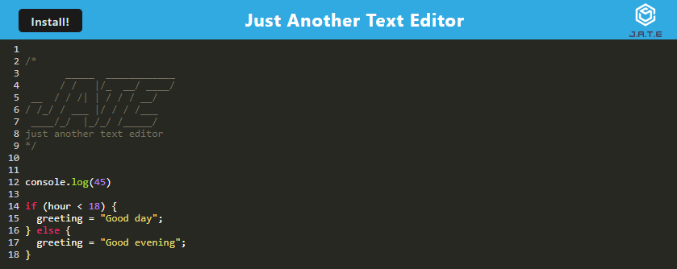

# Progressive Web Application

## Description

This is a progressive web application (PWA) text editor that runs in the browser. It features IndexedDB for getting and storing data and functions offline.
 
This application was created with the following criteria:

- Set up with a client server folder structure
- When run "npm run start" from the root directory, then the application should start up the backend and serve the client
- When run the text editor application from terminal JavaScript files have been bundled using webpack
- When run webpack plugins an HTML file, service worker, and manifest file is generated
- When use next-gen JavaScript the text editor still functions in teh browser without errors
- When open text editor the IndexedDB has immediately created database storage
- Content entered into the text editor is saved with IndexedDB
- When exit and reopen text editor the content is retrieved from IndexedDB
- When click Install button able to download web application as icon on desktop
- When load application a service worker is registered using workbox
- When a service worker is registered, have static assests pre-cached upon loading with subsequent pages and static assests
- Deployed to Heroku with proper build scripts for webpack application

## Table of Contents

- [Installation](#installation)
- [Usage](#usage)
- [License](#license)
- [Contributing](#contributing)

## Installation

- In order to use the application node.js will need to be installed.  
  Node.js Installation: https://nodejs.org/en/download

Node Dependencies:

- Root
  - if-env
- Client
  - code-mirror-themes
  - idb
- Server
  - Express

## Usage

To run the application locally use npm install to install all node packages from the root directory. Then run a npm run start to bundle and build application and start open on port 3000. Type code into the text editor to review. To install JATE click on the install button and confirm the prompt to install an icon for the app on your desktop.  
Look in the console DevTools and go to application to see manifest file, service worker, IndexedDB, and cache storage information.
 
 

## License

MIT License

## Contributing

The following websites were used for reference to create this application: 

- https://web.dev/articles/codelab-make-installable

## Deployed Application

[Heroku Link](https://frozen-meadow-91910-11d41093a8cd.herokuapp.com/)
